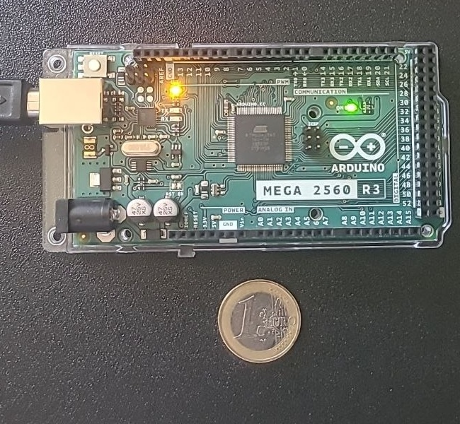
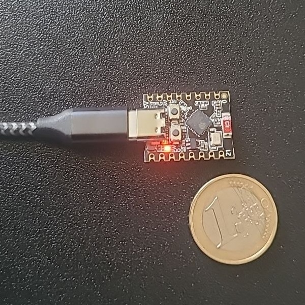

# LUT-KAN: Segment-wise LUT Quantization for Fast KAN Inference

[](https://arxiv.org/abs/2601.03332)
[](LICENSE)

This repository provides a reproducible benchmark suite for **segment-wise LUT (look-up table) inference** for Kolmogorov-Arnold Networks (KAN), supporting both **B-spline** and **Jacobi polynomial** basis functions.

<p align="center">
  
  &nbsp;&nbsp;&nbsp;
  
</p>
<p align="center"><em>Physical hardware platforms validated in this work: Arduino Mega 2560 R3 (ATmega2560, 8-bit AVR) and ESP32-C3 SuperMini (RISC-V), shown with 1-euro coin for scale.</em></p>

## What's New in v2.2.0

- ✅ **Endpoint-consistent LUT contract**: each spline segment now stores both endpoints, with
  `x[k,l] = t[k] + l/(L-1) * (t[k+1]-t[k])`, `l=0,...,L-1`, matching the runtime interpolation scale.
- 🧪 **NCA R1 reproducibility suite**: controlled numerical, genuine OOB-stress, DoS batch-1, and supplementary batch-scaling results are frozen under `reproducibility/ncaa_r1/`.
- 🎯 **Matched DoS baselines**: the revised CICIDS2017 case study compares the same trained KAN using matched NumPy/Numba B-spline and LUT implementations.
- 📐 **Explicit boundary semantics**: LUT sampling geometry is separated from `closed`/`half_open` runtime membership semantics; artifacts record `sample_grid=endpoint_inclusive`.
- 🔍 **Quantization clarification**: per-segment affine quantization parameters are derived from sampled LUT values; no external calibration dataset determines the quantization range.
- 🔥 **Fixed-point/MCU extensions retained**: integer-only Q16.16 kernels, ablations, end-to-end trained-model deployment, and physical Arduino Mega / ESP32-C3 validation remain part of the repository.

**Previous tagged releases:**
- v2.0.1: pre-R1 repository snapshot containing the MCU/Jacobi/fixed-point development line.
- v2.0.0: MCU benchmarking via Wokwi, Jacobi polynomial basis functions, and C export.

## Key Results

### NCA R1 Corrected CPU and Downstream Results

The v2.2.0 release uses the endpoint-inclusive LUT contract described above. The complete machine-readable results are stored under [`reproducibility/ncaa_r1/`](reproducibility/ncaa_r1/).

For the controlled B-spline experiment, increasing `L` reduces interpolation error initially, after which 8-bit quantization becomes dominant. The corrected results therefore do **not** use the earlier empirical `O(1/L)` error claim. `L=32` is a conservative generic accuracy-memory operating point for the controlled numerical study.

For the leakage-free CICIDS2017 DoS Hulk classifier (`78 -> 32 -> 16 -> 1`, test `n=92,430`), task-level performance is already saturated at `L=16`:

- Float PyKAN F1: **0.990017**
- LUT (`L=16`) F1: **0.990028** (one benign-flow decision difference; not interpreted as an improvement)
- LUT storage (`L=16`): **approximately 0.669 MiB**
- Batch-1 median matched Numba B-spline -> LUT speedup: **approximately 26.8×**
- `L=64` and `L=128` reproduce the Float PyKAN confusion matrix exactly.

The primary deployment claim uses matched Numba-to-Numba timing rather than a cross-framework PyKAN/PyTorch comparison.

The genuine OOB stress experiment uses unclipped Gaussian inputs and yields approximately **56.5%** of input vectors with at least one coordinate outside the LUT domain; the compiled evaluator preserves the selected policy-defined reference semantics.

### MCU Performance (Wokwi simulation, validated on real hardware)

| Target | Basis | N | Med. Speedup | Med. Speedup (FP) | Max | Med. Err |
|--------|-------|---|--------------|--------------------|-----|----------|
| ATmega2560 | B-spline | 8 | **20.8×** | **27.3×** | 27.1× | 0.051 |
| ATmega2560 | Jacobi | 40 | 3.5× | 4.6× | 9.0× | 0.103 |
| RP2040 | B-spline | 16 | **19.4×** | **28.2×** | 28.6× | 0.061 |
| RP2040 | Jacobi | 49 | 4.1× | 6.0× | 7.0× | 0.103 |
| STM32F103 | B-spline | 3 | **21.0×** | **29.1×** | 29.7× | 0.057 |
| STM32F103 | Jacobi | 14 | 2.8× | 4.0× | 6.3× | 0.122 |
| ESP32-C3 | B-spline | 10 | **14.8×** | **21.7×** | 22.3× | 0.067 |
| ESP32-C3 | Jacobi | 45 | 3.2× | 4.6× | 7.2× | 0.103 |

**Med. Speedup** = mixed float/int kernel; **Med. Speedup (FP)** = fixed-point kernel (v2.1).

### End-to-End Trained Model (Sine Regression, Degree-16 Chebyshev KAN)

| Platform | LUT Speedup | Fixed-Point Speedup | Task MSE Loss |
|----------|------------|--------------------|----|
| ATmega2560 | 20.2× | **33.7×** | <12% relative |
| RP2040 | 23.7× | **56.2×** | <12% relative |
| ESP32-C3 | 21.8× | **52.1×** | <12% relative |

Float MSE: 1.44×10⁻⁴ → LUT MSE: 1.62×10⁻⁴ (ΔMSE = 1.7×10⁻⁵)

### Ablation: Quantization-Only (No LUT) — Proves LUT is the Source of Speedup

| Platform | Quant-Only Speedup | Interpretation |
|----------|-------------------|----------------|
| ATmega2560 | 0.40× | Slower than float — recurrence dominates |
| RP2040 | 0.42× | Slower than float — recurrence dominates |
| STM32F103 | 0.36× | Slower than float — recurrence dominates |
| ESP32-C3 | 0.45× | Slower than float — recurrence dominates |

### Physical Hardware Validation (Wokwi vs Real Board)

| Platform | Configs Tested | Max Speedup Deviation |
|----------|---------------|-----------------------|
| Arduino Mega 2560 | 7 | **<0.1%** (cycle-accurate) |
| ESP32-C3 SuperMini | 7 | **<1.0%** (instruction-accurate) |

### CPU Performance

The previous pre-R1 CPU table has been superseded because it was generated before the endpoint-grid correction. Corrected endpoint-inclusive CPU results, including matched NumPy/Numba B-spline baselines, are available in:

- [`reproducibility/ncaa_r1/controlled/table_speed.csv`](reproducibility/ncaa_r1/controlled/table_speed.csv)
- [`reproducibility/ncaa_r1/dos_b1/latency_matched.csv`](reproducibility/ncaa_r1/dos_b1/latency_matched.csv)

## Three LUT Kernel Variants

The MCU benchmark evaluates three evaluation paths for every configuration:

| Variant | Description | Per-Edge Float Ops | Per-Edge Int Ops |
|---------|-------------|-------------------|-----------------|
| **Float baseline** | Direct polynomial/B-spline evaluation | O(d) or O(k²) | 0 |
| **Variant A** (mixed) | LUT with float input scaling + interpolation | 3 | 4 |
| **Variant B** (fixed-point) | LUT with Q16.16 integer input scaling + interpolation | **2** | **6** |
| **Quant-only** (ablation) | Int8 coefficients but full recurrence | O(d) + overhead | 0 |

## Repository Layout

```
lut-kan/
├── configs/                    # Experiment configurations
│   ├── jacobi_types/           # Jacobi polynomial configs
│   ├── sweeps/                 # Parameter sweep configs
│   └── generated/              # Auto-generated configs
├── scripts/
│   ├── train_and_export_endtoend.py  # 🆕 Train KAN → export LUT → MCU
│   ├── generate_paper_tables.py      # 🆕 LaTeX table generation
│   ├── mcu_qemu_benchmark.py         # ARM Cortex-M3 QEMU benchmark
│   ├── export_lut_to_c.py            # LUT → C header export
│   ├── publication_analysis.py       # IEEE/ACM tables & figures
│   └── unified_benchmark_sweeper.py
├── src/
│   ├── kernels/                # B-spline and LUT backends
│   ├── models/                 # Adapters (PyKAN, Jacobi, B-spline)
│   ├── quant/                  # LUT builder & quantization
│   └── metrics/                # Accuracy and performance metrics
├── mcu_auto/                   # 🆕 Automated MCU benchmark pipeline
│   ├── scripts/
│   │   ├── all.py              # One-command pipeline
│   │   ├── gen_cases.py        # Generate firmware from grid
│   │   ├── build_cases.py      # Compile with PlatformIO
│   │   ├── run_wokwi.py        # Headless Wokwi simulation
│   │   ├── run_hardware.py     # Real board upload
│   │   ├── collect_results.py  # Parse logs → CSV/Markdown
│   │   └── plot_results.py     # Visualization
│   ├── grids/
│   │   └── grid.yaml           # Parameter sweeps
│   ├── targets/                # Wokwi configs per target
│   ├── templates/
│   │   └── pio_project/
│   │       └── src/main.cpp    # 🔥 3-variant benchmark (A/B/quant-only)
│   ├── cases_e2e/              # 🆕 Trained model deployment cases
│   ├── cases/                  # Generated (gitignored)
│   ├── logs/                   # Generated (gitignored)
│   └── reports/                # Generated (gitignored)
├── figures/                    # Photos and plots
│   ├── photo_mega.jpg          # 🆕 Arduino Mega 2560 + coin
│   └── photo_esp32c3.jpg       # 🆕 ESP32-C3 SuperMini + coin
└── tests/                      # Numerical correctness tests
```

## Quick Start

### MCU Benchmark (Wokwi Simulation)

```bash
# 1. Install dependencies
pip install platformio pyyaml numpy
npm install -g @anthropic-ai/wokwi-cli

# 2. Set Wokwi token
export WOKWI_CLI_TOKEN="your-token-here"  # Get from https://wokwi.com/dashboard/ci

# 3. Generate, build, simulate, collect
cd mcu_auto
python scripts/gen_cases.py --suite smoke --targets mega,pico,esp32c3
python scripts/build_cases.py
python scripts/run_wokwi.py
python scripts/collect_results.py

# 4. View results
cat reports/summary.md
```

### End-to-End Trained Model

```bash
# Train a Chebyshev KAN on sine regression, export to LUT C headers
python scripts/train_and_export_endtoend.py --degree 16 --output-dir mcu_auto/cases_e2e

# Then build and run as above
```

### Physical Hardware

```bash
# Flash to real Arduino Mega (auto-detects COM port)
pio run -d mcu_auto/cases/mega/<case_id> -t upload

# Read serial output
pio device monitor -b 115200
```

For ESP32-C3 SuperMini, add to `platformio.ini`:
```ini
build_flags = -DARDUINO_USB_CDC_ON_BOOT=1 -DARDUINO_USB_MODE=1
```
and increase startup delay in `setup()`:
```cpp
Serial.begin(115200);
while (!Serial) delay(10);
delay(3000);
```

## Supported Targets

| Target | ISA | Clock | Flash | RAM | FPU | Wokwi | Real HW |
|--------|-----|-------|-------|-----|-----|-------|---------|
| `mega` | 8-bit AVR | 16 MHz | 256 KB | 8 KB | ❌ | ✅ | ✅ Validated |
| `pico` | ARM Cortex-M0+ | 133 MHz | 2 MB | 264 KB | ❌ | ✅ | — |
| `stm32f103` | ARM Cortex-M3 | 72 MHz | 64 KB | 20 KB | ❌ | ✅ | — |
| `esp32c3` | RISC-V | 160 MHz | 4 MB | 400 KB | ❌ | ✅ | ✅ Validated |
| `esp32` | Xtensa LX6 | 240 MHz | 4 MB | 520 KB | ✅ | ✅ | — |
| `esp32s3` | Xtensa LX7 | 240 MHz | 8 MB | 512 KB | ✅ | ✅ | — |

## Supported Basis Functions

| Basis | Families | Float Baseline | LUT Forward |
|-------|----------|----------------|-------------|
| `jacobi` | Chebyshev T/U, Legendre, Gegenbauer | 3-term recurrence | Segment-wise quantized LUT |
| `bspline` | Cubic B-splines (configurable degree) | Cox-de Boor + SiLU | Segment-wise quantized LUT |

## Customizing Parameter Sweeps

Edit `mcu_auto/grids/grid.yaml`:

```yaml
suites:
  my_experiment:
    in_dim: [8]
    out_dim: [8]
    basis_type: [jacobi, bspline]
    poly_family: [chebyshev_t, legendre]
    degree: [3, 5, 8, 12, 16, 20]
    L: [32, 64]
    segments: [8]
    interp: [linear]
    scheme: [uint8_asymm]
```

Then run:
```bash
cd mcu_auto
python scripts/all.py --suite my_experiment --targets mega,esp32c3 --jobs 4
```

## Reproducibility

The compact reproducibility record for the NCA R1 revision is available at:

[`reproducibility/ncaa_r1/`](reproducibility/ncaa_r1/)

It contains aggregate and per-run controlled results, the OOB stress study, the primary batch-1 DoS benchmark, validation checks, memory accounting, and supplementary batch-scaling results. Large generated LUT artifacts and temporary run directories are intentionally excluded from Git.

The leakage-free CICIDS2017 training pipeline and trained-model provenance are frozen separately in `KuznetsovKarazin/kan-dos-detection` at tag `ncaa-r1-dos-20260815`.

## Citation

For software reproducibility, use the `v2.2.0` release together with the frozen `reproducibility/ncaa_r1/` record.

If you use this work in your research, please cite:

```bibtex
@article{Kuznetsov_2026,
  title   = {LUT-KAN: Segment-wise LUT Quantization for Fast KAN Inference},
  author  = {Kuznetsov, Oleksandr},
  journal = {arXiv preprint arXiv:2601.03332},
  year    = {2026},
  url     = {https://arxiv.org/abs/2601.03332}
}
```

## License

MIT License. See [LICENSE](LICENSE) for details.

## Contact

- **Author**: Oleksandr Kuznetsov
- **Email**: oleksandr.kuznetsov@uniecampus.it
- **Affiliations**: eCampus University (Italy), V.N. Karazin Kharkiv National University (Ukraine)
- **Repository**: https://github.com/KuznetsovKarazin/lut-kan

## Acknowledgments

- [PyKAN](https://github.com/KindXiaoming/pykan) — B-spline KAN implementation
- [JacobiKAN](https://github.com/SpaceLearner/JacobiKAN) — Jacobi polynomial reference
- [Wokwi](https://wokwi.com/) — MCU simulation platform
- [PlatformIO](https://platformio.org/) — Embedded build system
